# FlightBooking & SkyAdmin - AI & ML Powered Flight Management System

> **ASP.NET Core 6.0 MVC**, **MongoDB**, **ML.NET**, ve **OpenAI GPT-4o** entegrasyonu ile geliştirilmiş; dinamik uçuş arama, 5 adımlı online check-in, biniş kartı üretimi, yapay zeka seyahat asistanı, makine öğrenmesi destekli overbooking tahmini ve risk analizi sunan uçtan uca uçuş yönetim platformu.

---

## 📌 İçindekiler / Table of Contents
- [🇹🇷 Türkçe](#-türkçe)
  - [Proje Hakkında](#-proje-hakkında)
  - [Öne Çıkan Özellikler](#-öne-çıkan-özellikler)
  - [Yapay Zeka ve Makine Öğrenmesi Mimarisi](#-yapay-zeka-ve-makine-öğrenmesi-mimarisi)
  - [Teknoloji Yığını](#-teknoloji-yığını)
  - [Ekran Görüntüleri ve Kullanıcı Yolculuğu](#-ekran-görüntüleri-ve-kullanıcı-yolculuğu)
  - [Kurulum ve Çalıştırma](#-kurulum-ve-çalıştırma)
  - [Proje Yapısı](#-proje-yapısı)
  - [Değerlendirme Notları](#-değerlendirme-notları)
- [🇬🇧 English](#-english)
  - [About The Project](#-about-the-project)
  - [Key Features](#-key-features)
  - [AI & Machine Learning Architecture](#-ai--machine-learning-architecture)
  - [Tech Stack](#-tech-stack)
  - [Screenshot Gallery & User Journey](#-screenshot-gallery--user-journey)
  - [Setup & Installation](#-setup--installation)
  - [Project Structure](#-project-structure)
  - [Evaluation Notes](#-evaluation-notes)

---

# 🇹🇷 Türkçe

## ✈️ Proje Hakkında

**FlightBooking & SkyAdmin**, modern havacılık ve yolcu yönetimi gereksinimlerini karşılamak amacıyla tasarlanmış nesne yönelimli, modüler ve AI/ML destekli bir web uygulamasıdır. 

Sistem iki ana modülden oluşmaktadır:
1. **SkyRoute (Kamu / Yolcu Portalı):** Kullanıcıların uçuş aramasına, popüler rotaları keşfetmesine ve OpenAI destekli **Yapay Zeka Seyahat Asistanı** ile etkileşime girmesine olanak tanır.
2. **SkyAdmin (Yönetim & Operasyon Portalı):** Uçuş yönetimi, yolcu ve rezervasyon takibi, 5 aşamalı online check-in süreci, ML.NET ile uçuş doluluk ve yolcu talebi tahminleri ile gelişmiş overbooking/no-show risk analiz merkezini barındırır.

---

## 🚀 Öne Çıkan Özellikler

### 🌐 Yolcu Portalı & Arama (SkyRoute)
- **Çoklu Uçuş Arama Desteği:** Tek yön, gidiş-dönüş ve çoklu uçuş arama seçenekleri.
- **Dinamik IATA Çözümleme:** Şehir isimlerinden otomatik IATA havalimanı kodu ve havalimanı ismi eşleştirme.
- **Popüler Destinasyonlar:** İstanbul çıkışlı popüler rotaların (Amsterdam, Milano, Paris, Roma, Berlin, Londra) başlangıç fiyatları ve direkt uçuş arama bağlantıları.

### 🤖 GPT-4o Destekli Yapay Zeka Seyahat Asistanı (`/Agent/AskAgent`)
- **Doğal Dil İle Seyahat Danışmanlığı:** Restoran önerileri, gezilecek yerler, seyahat planlama, ulaşım ve yerel kafeler hakkında soru-cevap.
- **Niyet Algılama (Intent Detection):** Kullanıcı girdisinden `TravelIntentDetector` ile yemek, otel, ulaşım, döviz, gezi planı veya hava durumu niyetinin otomatik tespiti.
- **Canlı Bilgi Bileşenleri:** Gerçek zamanlı hava durumu, yerel saat ve canlı döviz kurları için arayüz widget'ları.

### 🛠️ SkyAdmin Yönetim Portalı
- **Uçuş Yönetimi (`/Admin/Flights`):** Tüm uçuşların listelenmesi, yeni uçuş oluşturulması, havayolu, kalkış/varış noktası, kapasite, fiyat ve canlı durum (Planlandı, Gecikmeli, İptal) takibi.
- **Uçuş Detayı ve Yolcu Manifestosu (`/Admin/Flights/FlightDetail`):** Uçuşa bağlı yolcu listesi, PNR numaraları, check-in durumları, ödeme ve bilet durumları, koltuk haritası görünümü ve Excel olarak indirme.
- **Rezervasyon Yönetimi (`/Admin/Booking`):** Tüm rezervasyonların uçuş numarası, yolcu bilgisi, toplam fiyat ve durum (Onaylandı, Beklemede, İptal) bazında filtrelenebilir listesi.
- **5 Aşamalı İnteraktif Online Check-In (`/Admin/CheckIn`):**
  - *Bagaj Seçimi:* Kabin valizi boyut/ağırlık seçimleri ve uçak altı bagaj ağırlık slider'ı.
  - *Koltuk Seçimi:* Pencere, orta, koridor, ön sıra ve çıkış sırası filtreli görsel koltuk haritası.
  - *Yemek Seçimi:* Uçuş içi menü tercihi.
  - *Ek Hizmetler:* Sigorta, havalimanı transferi ve ek bagaj seçeneği.
  - *Onay ve Biniş Kartı:* Barkodlu, PNR'lı ve uçuş detaylı dijital biniş kartı (Boarding Pass) üretimi.

### 📊 ML.NET İle Makine Öğrenmesi & Overbooking Analitiği
- **Uçuş Yoğunluk Tahmini (`/Admin/Forecast/Predict`):** `SdcaLogisticRegression` ikili sınıflandırma algoritması kullanılarak uçuş tarihine ve tipine göre doluluk ihtimali tahmini.
- **2027 Ocak Ayı Yolcu Yoğunluk Tahmini (`/Admin/FlightRegression/January2027Forecast`):** `FastTree` regresyon modeli ile 31 günlük sabah ve akşam uçuşlarının yolcu sayısı ve doluluk oranı tahmini.
- **AI Risk Zekası ve Isı Haritası (`/Admin/OverBooking/Index`):** Slot x Hafta bazında No-Show oranlarının hesaplanması, en riskli ve en stabil uçuş slotlarının tespiti, overbooking önerileri ve risk ısı haritası.
- **AI Overbooking Tahmin Merkezi (`/Admin/OverbookingForecast/Index`):** Geçmiş uçuş logları ve no-show kalıpları eğitilerek slot bazlı beklenen no-show yolcu sayısı, maksimum bilet satış limiti ve potansiyel ek gelir hesaplaması.

---

## 🧠 Yapay Zeka ve Makine Öğrenmesi Mimarisi

Uygulamadaki AI ve ML özellikleri iki farklı katmanda ayrıştırılmıştır:

```
                          ┌─────────────────────────────────────────────────────────┐
                          │                 FlightBooking Platform                  │
                          └────────────────────────────┬────────────────────────────┘
                                                       │
                       ┌───────────────────────────────┴───────────────────────────────┐
                       ▼                                                               ▼
       ┌───────────────────────────────┐                               ┌───────────────────────────────┐
       │   OpenAI GPT-4o Integration   │                               │     ML.NET Analytics Engine   │
       │       (AgentServices)         │                               │ (Services/MachineLearning...) │
       └───────────────┬───────────────┘                               └───────────────┬───────────────┘
                       │                                                               │
     ┌─────────────────┴─────────────────┐                           ┌─────────────────┴─────────────────┐
     │ • TravelAgentService              │                           │ • FlightMlService                 │
     │ • TravelPromptBuilder             │                           │   (SdcaLogisticRegression)        │
     │ • TravelIntentDetector            │                           │ • FlightRegressionService         │
     │ • OpenAICityExtractor             │                           │   (FastTree Regression)           │
     └───────────────────────────────────┘                           │ • NoShowPredictionService         │
                                                                     │   (FastTree No-Show Forecasting)  │
                                                                     │ • OverbookingRecommendationServ.  │
                                                                     └───────────────────────────────────┘
```

1. **OpenAI GPT-4o Entegrasyonu (`AgentServices/`):**
   - HTTP üzerinden OpenAI Chat Completions API ile haberleşir.
   - `TravelPromptBuilder` kullanılarak asistanın profesyonel Türkçe yanıtlar vermesi, Markdown formatı ve yapılı listeler sunması sağlanır.
   - `TravelIntentDetector` kullanıcı mesajındaki kelimeleri analiz ederek isteği doğru kategoriye yönlendirir.

2. **ML.NET Makine Öğrenmesi Servisleri (`Services/MachineLearningServices/` & `Services/OverBookingNoShowServices/`):**
   - **`FlightMlService`:** `SdcaLogisticRegression` algoritması ile `Month`, `DayOfWeek` ve `FlightType` (Sabah/Akşam) özniteliklerini işleyerek uçuşun dolu olma ihtimalini (`IsFull`) tahmin eder.
   - **`FlightRegressionService`:** `FastTree` regresyon algoritmasını kullanarak gelecekteki tarihler için sayısal yolcu yoğunluğu (`PassengerCount`) tahmini yapar.
   - **`NoShowPredictionService`:** MongoDB üzerindeki `NoShowHistories` koleksiyonunda bulunan bilet satışı, online check-in, havalimanı check-in, kaçırılan aktarma ve iptal verilerini işleyerek 2027 yılı için slot bazlı No-Show yolcu sayılarını tahmin eder.

---

## 🛠️ Teknoloji Yığını

| Bileşen | Teknoloji / Kütüphane | Açıklama |
| :--- | :--- | :--- |
| **Framework** | ASP.NET Core 6.0 (`net6.0`) | MVC mimarisi ve Areas yapılandırması |
| **Veritabanı** | MongoDB (`MongoDB.Driver` v3.11.2) | Esnek NoSQL doküman tabanlı veri depolama |
| **Makine Öğrenmesi** | ML.NET (`Microsoft.ML` v5.0.0, `Microsoft.ML.FastTree` v5.0.0) | İkili sınıflandırma ve regresyon tahmin modelleri |
| **Yapay Zeka** | OpenAI API (`gpt-4o`) | Doğal dil işleme ve akıllı seyahat danışmanı |
| **Nesne Eşleme** | AutoMapper (v13.0.1) | Entity ve DTO katmanları arası dönüşüm |
| **Doğrulama** | FluentValidation (v11.12.0) | Model ve DTO doğrulama kuralları |
| **Dış Servisler** | RapidAPI / Yahoo Weather API | Havalimanı IATA arama ve canlı hava durumu entegrasyonu |
| **Ön Yüz (Frontend)** | Razor Views, Bootstrap, jQuery, Custom CSS/JS | GeAir kamu teması ve SkyAdmin yönetim paneli |

---

## 📸 Ekran Görüntüleri ve Kullanıcı Yolculuğu

Aşağıdaki galeri, uygulamanın yolcu portalından başlayıp admin paneli, online check-in ve makine öğrenmesi tahminlerine uzanan uçtan uca yolculuğunu göstermektedir:

### 1. Yolcu Portalı ve Uçuş Arama
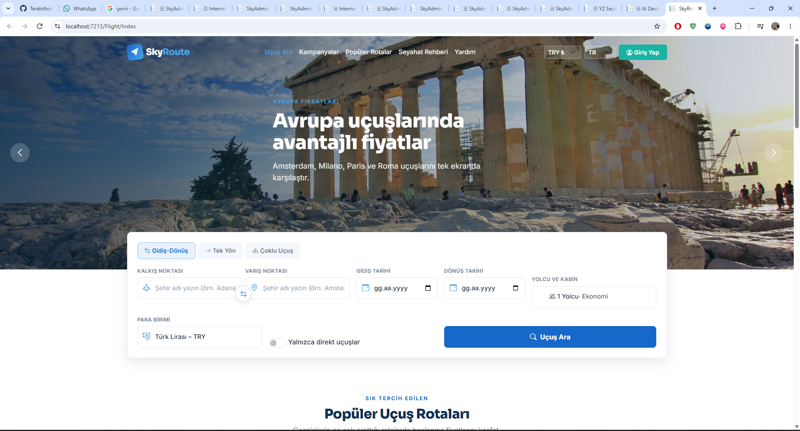
*SkyRoute ana sayfası; gidiş-dönüş, tek yön ve çoklu uçuş arama formu ile para birimi ve yolcu seçim paneli.*

### 2. Popüler Uçuş Rotaları
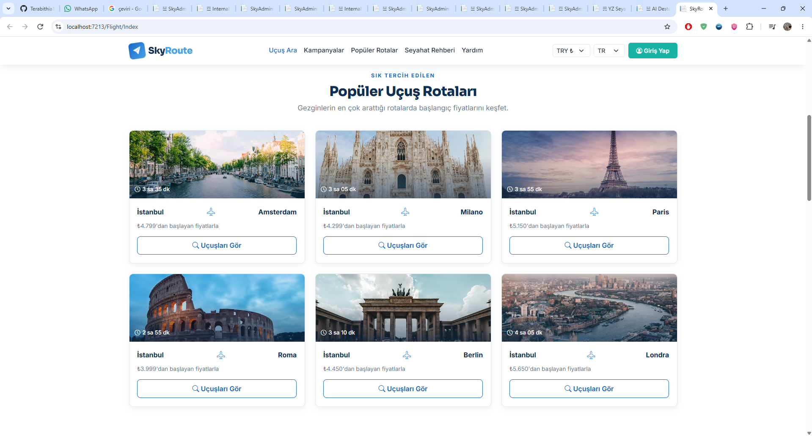
*İstanbul çıkışlı popüler Avrupa destinasyonları ve başlangıç fiyatları.*

### 3. Yapay Zeka Seyahat Asistanı
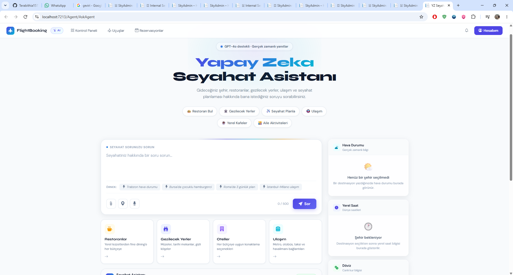
*GPT-4o destekli seyahat danışmanı; hızlı soru butonları, hava durumu, yerel saat ve döviz kurları widget'ları.*

### 4. Admin Uçuş Yönetim Paneli
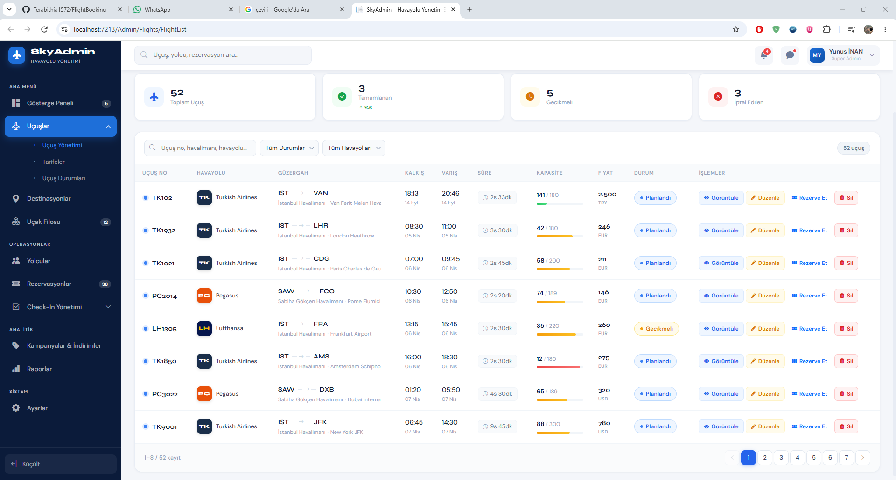
*SkyAdmin uçuş yönetim paneli; toplam uçuş istatistikleri, rötar/iptal durumları ve uçuş listesi.*

### 5. Uçuş Detayı ve Yolcu Manifestosu
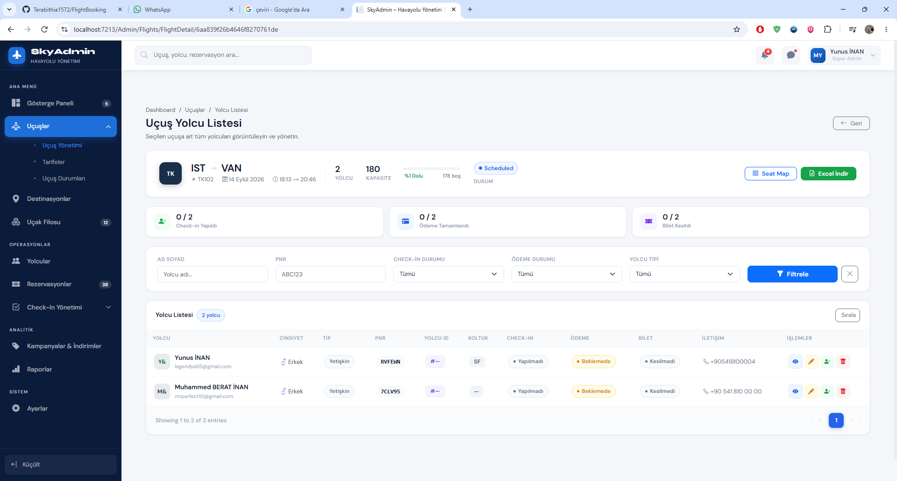
*Seçilen uçuşa ait yolcu detayları, PNR kodları, check-in durumları ve koltuk bilgileri.*

### 6. Rezervasyon Listesi
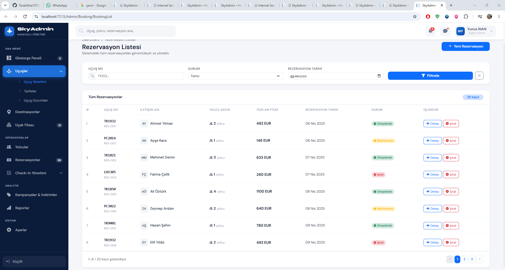
*Sistemdeki tüm rezervasyonların uçuş numarası, yolcu sayısı ve ödeme durumuna göre listelenmesi.*

### 7. Online Check-In - Bagaj Seçimi
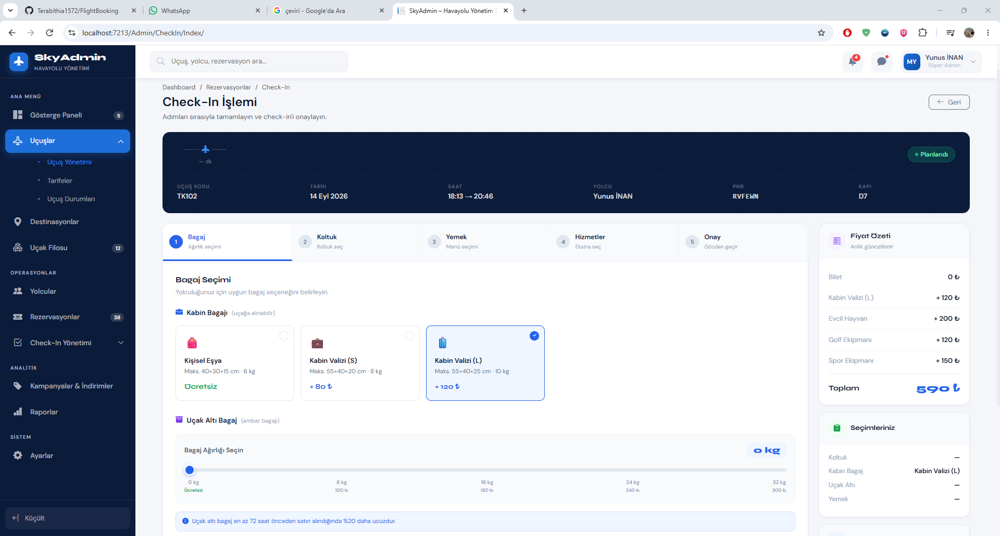
*5 adımlı check-in sürecinin 1. adımı: El bagajı ve ambar bagajı ağırlık seçimi.*

### 8. Online Check-In - Koltuk Haritası
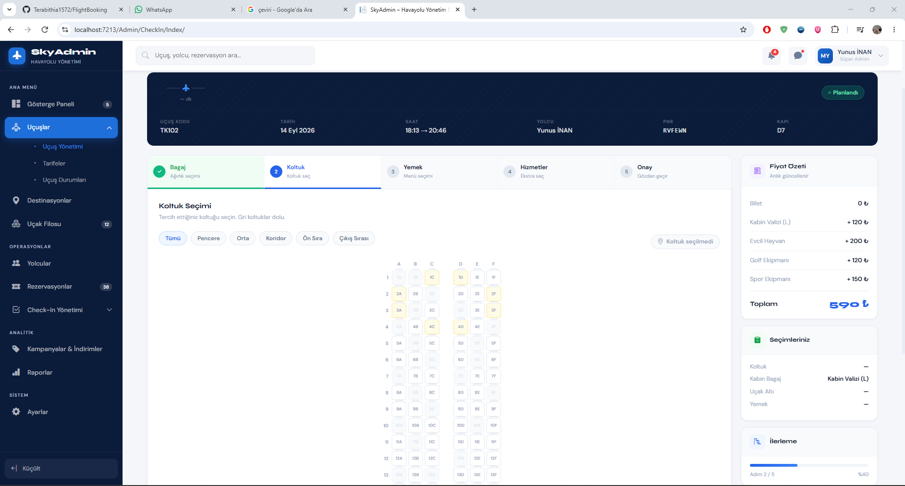
*İnteraktif koltuk seçim haritası; pencere, koridor ve çıkış sırası filtreleme.*

### 9. Tamamlanan Check-In & Biniş Kartı (Boarding Pass)
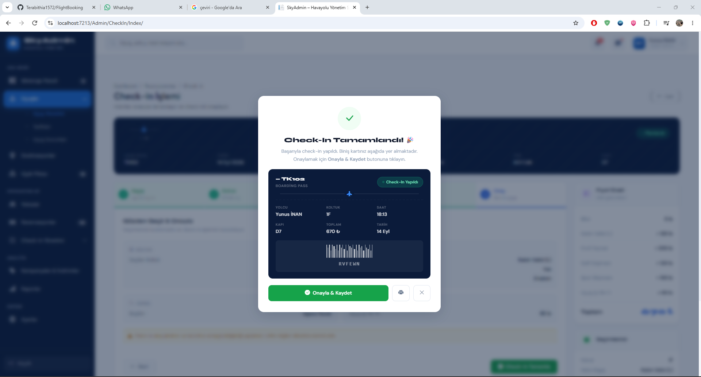
*Check-in tamamlama ekranı ve üretilen dijital biniş kartı (Boarding Pass).*

### 10. ML.NET Uçuş Doluluk Tahmini
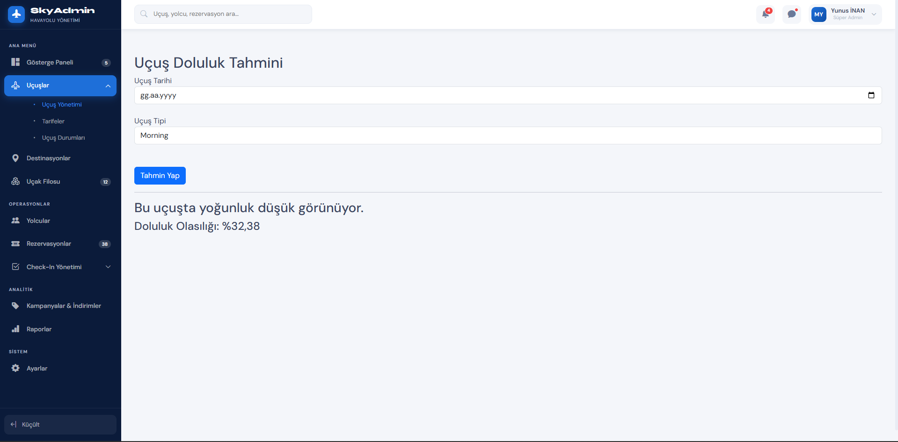
*ML.NET binary classification modeli ile tarih ve uçuş tipine göre doluluk olasılığı tahmini.*

### 11. 2027 Ocak Yolcu Yoğunluk Tahmini
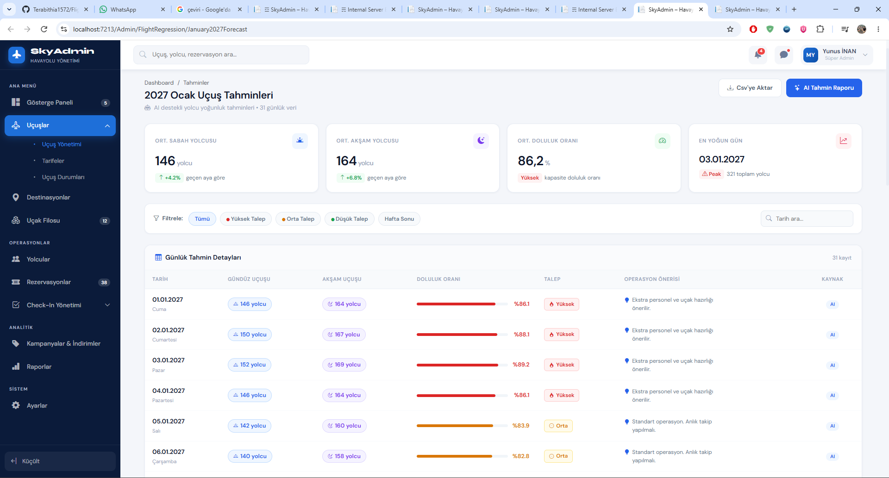
*ML.NET regresyon modeli ile 2027 Ocak ayı günlük sabah/akşam yolcu sayıları ve operasyonel tavsiyeler.*

### 12. AI Risk Analizi & Overbooking Isı Haritası
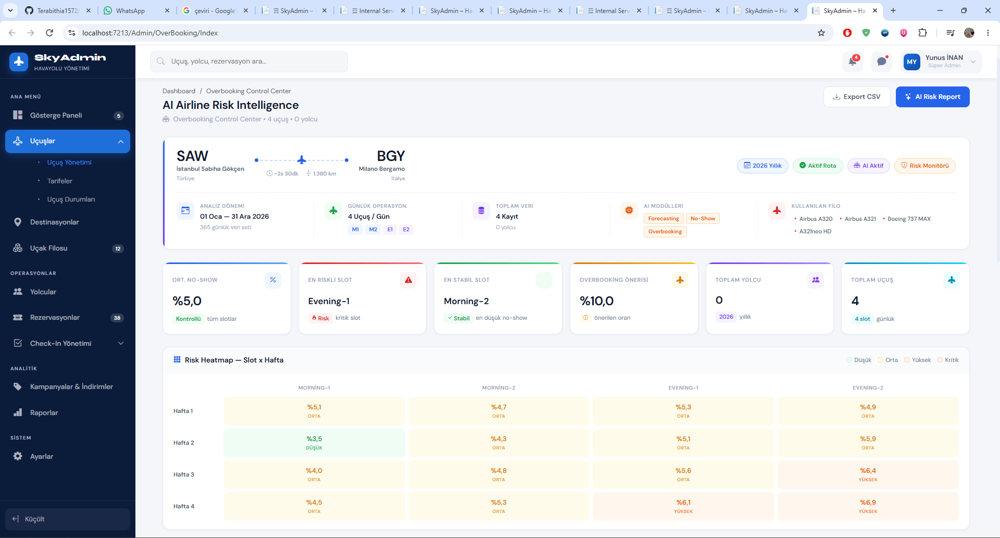
*Slot x Hafta bazında No-Show oranları, en riskli/stabil zaman dilimleri ve risk ısı haritası.*

### 13. AI Overbooking Tahmin ve Gelir Optimizasyon Merkezi
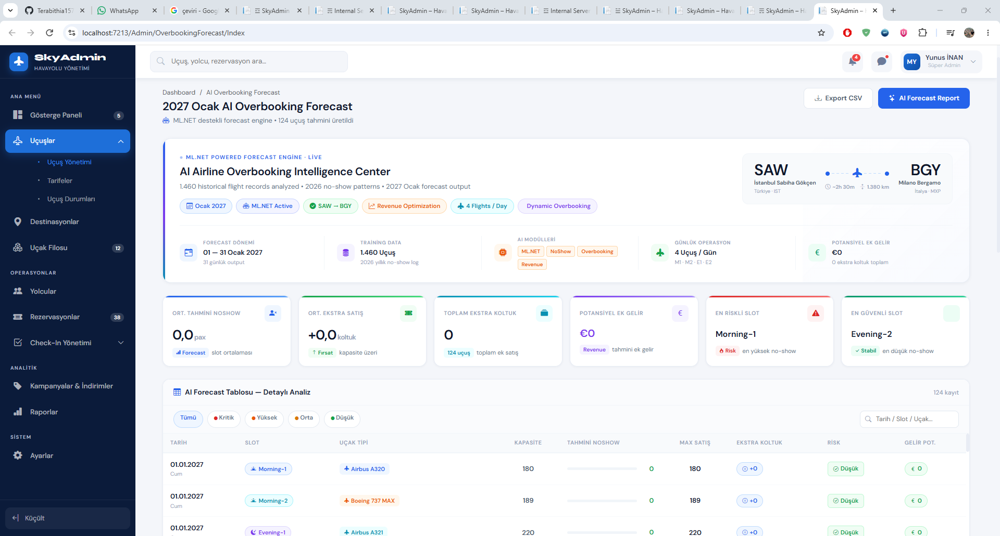
*Geçmiş verilerle eğitilmiş ML.NET motoru ile maksimum bilet satış limiti ve ekstra gelir tahmini.*

---

## ⚙️ Kurulum ve Çalıştırma

### Gereksinimler
- **.NET 6.0 SDK** (veya üzeri)
- **MongoDB Server** (Yerel ortamda `mongodb://localhost:27017` üzerinde çalışan varsayılan MongoDB örneği)
- **OpenAI API Anahtarı** *(Yapay Zeka seyahat asistanı kullanımı için isteğe bağlı)*

### 1. Depoyu Klonlayın
```bash
git clone https://github.com/Terabithia1572/FlightBooking.git
cd FlightBooking
```

### 2. Yapılandırma (`appsettings.json`)
Proje içerisindeki `FlightBooking/appsettings.json` dosyasında veritabanı ayarlarının doğru olduğunu doğrulayın:

```json
{
  "DatabaseSettingsKey": {
    "ConnectionString": "mongodb://localhost:27017",
    "DatabaseName": "FlightBookingDb",
    "FlightCollectionName": "Flights",
    "BookingCollectionName": "Bookings",
    "CheckInCollectionName": "CheckIns",
    "FlightDemandHistoryCollection": "FlightDemandHistories",
    "NoShowHistoryCollection": "NoShowHistories"
  }
}
```

> **🔑 OpenAI Yapılandırması (İsteğe Bağlı):**
> Yapay Zeka Seyahat Asistanı özelliğini aktif kullanmak istiyorsanız `appsettings.json` içerisine aşağıdaki bloğu ekleyebilirsiniz:
> ```json
> "OpenAISettingsKey": {
>   "ApiKey": "YOUR_OPENAI_API_KEY",
>   "Model": "gpt-4o"
> }
> ```

### 3. Bağımlılıkları Yükleyin ve Derleyin
```bash
dotnet restore
dotnet build
```

### 4. Uygulamayı Çalıştırın
```bash
dotnet run --project FlightBooking
```
Uygulama başlatıldıktan sonra tarayıcınızda `https://localhost:7213` veya `http://localhost:5213` adresine giderek platforma erişebilirsiniz.

---

## 📁 Proje Yapısı

```
FlightBooking/
├── FlightBooking/
│   ├── AgentServices/              # OpenAI entegrasyonu, PromptBuilder ve IntentDetector
│   │   ├── CityDetectors/
│   │   ├── IntentDetectors/
│   │   ├── OpenAIServices/
│   │   ├── PromptBuilders/
│   │   └── TravelAgentService/
│   ├── AgentSettings/              # OpenAI yapılandırma sınıfları
│   ├── Areas/
│   │   └── Admin/                  # SkyAdmin yönetim paneli (Controllers & Views)
│   │       ├── Controllers/        # Flights, Booking, CheckIn, Forecast, OverBooking vb.
│   │       └── Views/
│   ├── Controllers/                # Kamu portalı denetleyicileri (AgentController, FlightController)
│   ├── DTOs/                       # Katmanlar arası veri taşıma nesneleri
│   ├── Entites/                    # MongoDB veri modelleri (Flight, Booking, CheckIn, NoShowHistory vb.)
│   ├── MachineLearningModels/      # ML.NET classification veri ve tahmin modelleri
│   ├── MachineLearningRegressionModels/ # ML.NET regression veri ve tahmin modelleri
│   ├── Mapping/                    # AutoMapper profil tanımları
│   ├── Services/                   # İş mantığı servisleri
│   │   ├── AirportServices/
│   │   ├── BookingServices/
│   │   ├── CheckInServices/
│   │   ├── FlightServices/
│   │   ├── MachineLearningServices/ # FlightMlService & FlightRegressionService
│   │   ├── NoShowServices/         # Overbooking & NoShow analiz servisleri
│   │   └── OverBookingNoShowServices/ # ML.NET NoShowPredictionService
│   ├── Settings/                   # Veritabanı ve genel ayar sınıfları
│   ├── Tools/                      # WeatherTool ve dış servis araçları
│   ├── Views/                      # Kamu portalı Razor görünümleri
│   ├── wwwroot/                    # Statik varlıklar (CSS, JS, Temalar, Görseller)
│   └── Program.cs                  # IoC Konteyner & DI servis kayıtları
├── docs/
│   └── screenshots/                # README ekran görüntüleri
└── FlightBooking.sln
```

---

## 📝 Değerlendirme Notları

- **Veritabanı Başlatma:** Uygulama MongoDB NoSQL mimarisini kullanmaktadır. Otomatik koleksiyon oluşturma MongoDB sürücüsü tarafından yönetilir.
- **ML Model Eğitimi:** Makine öğrenmesi modelleri bellek içi (in-memory) veri kütleleriyle eğitilmektedir. Admin panelindeki **Modeli Eğit** butonları tıklanarak ML.NET modelleri anlık olarak yeniden eğitilebilir.
- **API Anahtarları:** Projede gizli anahtarlar veya canlı API kimlik bilgileri yer almamaktadır. Dış servisler yapılandırılmadığında uygulama hata fırlatmak yerine güvenli fallback yanıtları döner.

---
---

# 🇬🇧 English

## ✈️ About The Project

**FlightBooking & SkyAdmin** is an end-to-end, modular, object-oriented web application designed to meet modern airline management and passenger reservation standards, enhanced with Artificial Intelligence (AI) and Machine Learning (ML).

The application comprises two main portals:
1. **SkyRoute (Public Passenger Portal):** Enables users to search flights, explore popular destinations, and interact with a GPT-4o powered **AI Travel Assistant**.
2. **SkyAdmin (Management & Operations Portal):** Provides comprehensive flight management, passenger & booking tracking, a 5-step interactive online check-in workflow, ML.NET powered occupancy & passenger demand forecasting, and an advanced overbooking/no-show risk intelligence center.

---

## 🚀 Key Features

### 🌐 Public Passenger Portal & Search (SkyRoute)
- **Multi-Way Flight Search:** Support for One-Way, Round-Trip, and Multi-City search options.
- **Dynamic IATA Resolution:** Automatic matching of city names to official IATA airport codes and names.
- **Popular Destinations:** Highlighted popular routes originating from Istanbul (Amsterdam, Milan, Paris, Rome, Berlin, London) with starting prices and direct search links.

### 🤖 GPT-4o Powered AI Travel Assistant (`/Agent/AskAgent`)
- **Natural Language Travel Consultation:** Interactive Q&A for restaurant recommendations, sightseeing spots, itinerary planning, transportation, and local coffee shops.
- **Intent Detection (`TravelIntentDetector`):** Automatic classification of user intent into categories such as Food, Hotel, Transport, Currency, Itinerary, or Weather.
- **Live Widgets:** Real-time UI widgets for live weather conditions, local time zone, and foreign currency rates.

### 🛠️ SkyAdmin Operational Portal
- **Flight Management (`/Admin/Flights`):** Comprehensive flight listing, creation, airline assignment, departure/arrival routes, capacity tracking, pricing, and live status management (Scheduled, Delayed, Cancelled).
- **Flight Detail & Passenger Manifest (`/Admin/Flights/FlightDetail`):** Live passenger lists per flight, PNR numbers, check-in tracking, payment & ticketing statuses, seat map overlays, and Excel export.
- **Booking Management (`/Admin/Booking`):** Centralized reservation list with multi-criteria filtering by flight number, passenger count, total price, and status (Confirmed, Pending, Cancelled).
- **5-Step Interactive Online Check-In (`/Admin/CheckIn`):**
  - *Baggage Selection:* Cabin baggage options and under-aircraft checked baggage weight slider.
  - *Seat Selection:* Interactive visual seat grid with filters for Window, Aisle, Middle, Front Row, and Exit Row seats.
  - *Meal Selection:* In-flight meal menu choices.
  - *Services:* Extra services including insurance and transfers.
  - *Confirmation & Boarding Pass:* Instant digital Boarding Pass generation featuring barcode, PNR, flight details, and gate info.

### 📊 ML.NET Machine Learning & Overbooking Analytics
- **Flight Density Prediction (`/Admin/Forecast/Predict`):** `SdcaLogisticRegression` binary classification model predicting flight occupancy probability based on flight date and type.
- **January 2027 Passenger Demand Forecasting (`/Admin/FlightRegression/January2027Forecast`):** `FastTree` regression model predicting daily morning/evening passenger volume and peak days for a 31-day window.
- **AI Risk Intelligence & Heatmap (`/Admin/OverBooking/Index`):** Slot x Week no-show rate calculations, identification of most risky vs. most stable slots, overbooking recommendations, and a visual risk heatmap.
- **AI Overbooking Intelligence Center (`/Admin/OverbookingForecast/Index`):** ML.NET forecast engine trained on historical flight logs and no-show patterns, calculating expected no-show passengers, recommended max sales limits, extra sellable seats, and potential extra revenue.

---

## 🧠 AI & Machine Learning Architecture

The AI and ML capabilities of the platform are strictly modularized into two distinct layers:

```
                          ┌─────────────────────────────────────────────────────────┐
                          │                 FlightBooking Platform                  │
                          └────────────────────────────┬────────────────────────────┘
                                                       │
                       ┌───────────────────────────────┴───────────────────────────────┐
                       ▼                                                               ▼
       ┌───────────────────────────────┐                               ┌───────────────────────────────┐
       │   OpenAI GPT-4o Integration   │                               │     ML.NET Analytics Engine   │
       │       (AgentServices)         │                               │ (Services/MachineLearning...) │
       └───────────────┬───────────────┘                               └───────────────┬───────────────┘
                       │                                                               │
     ┌─────────────────┴─────────────────┐                           ┌─────────────────┴─────────────────┐
     │ • TravelAgentService              │                           │ • FlightMlService                 │
     │ • TravelPromptBuilder             │                           │   (SdcaLogisticRegression)        │
     │ • TravelIntentDetector            │                           │ • FlightRegressionService         │
     │ • OpenAICityExtractor             │                           │   (FastTree Regression)           │
     └───────────────────────────────────┘                           │ • NoShowPredictionService         │
                                                                     │   (FastTree No-Show Forecasting)  │
                                                                     │ • OverbookingRecommendationServ.  │
                                                                     └───────────────────────────────────┘
```

1. **OpenAI GPT-4o Integration (`AgentServices/`):**
   - Communicates via HTTP with the OpenAI Chat Completions endpoint.
   - `TravelPromptBuilder` enforces structured Markdown responses in Turkish with custom guidelines.
   - `TravelIntentDetector` parses prompt keywords to detect intent and route user requests accordingly.

2. **ML.NET Machine Learning Engine (`Services/MachineLearningServices/` & `Services/OverBookingNoShowServices/`):**
   - **`FlightMlService`:** Uses `SdcaLogisticRegression` to process `Month`, `DayOfWeek`, and `FlightType` (Morning/Evening) to predict flight occupancy likelihood (`IsFull`).
   - **`FlightRegressionService`:** Uses `FastTree` regression to forecast future numerical passenger counts (`PassengerCount`).
   - **`NoShowPredictionService`:** Trains on historical data in MongoDB `NoShowHistories` (sold tickets, online check-ins, airport check-ins, missed connections, cancellations) to predict slot-based no-show passenger counts for January 2027.

---

## 🛠️ Tech Stack

| Component | Technology / Library | Description |
| :--- | :--- | :--- |
| **Framework** | ASP.NET Core 6.0 (`net6.0`) | MVC Architecture with Areas support |
| **Database** | MongoDB (`MongoDB.Driver` v3.11.2) | Flexible NoSQL document database |
| **Machine Learning** | ML.NET (`Microsoft.ML` v5.0.0, `Microsoft.ML.FastTree` v5.0.0) | Binary classification & regression models |
| **Artificial Intelligence** | OpenAI API (`gpt-4o`) | Natural language processing travel consultant |
| **Object Mapping** | AutoMapper (v13.0.1) | DTO to Entity object mapping |
| **Validation** | FluentValidation (v11.12.0) | Model & DTO validation rules |
| **External Services** | RapidAPI / Yahoo Weather API | Airport IATA search & live weather forecasts |
| **Frontend** | Razor Views, Bootstrap, jQuery, Custom CSS/JS | GeAir public theme & SkyAdmin dashboard theme |

---

## 📸 Screenshot Gallery & User Journey

The following screenshots illustrate the complete user journey from public search to admin management, online check-in, and ML forecasting:

### 1. Public Portal & Flight Search

*SkyRoute home page featuring round-trip, one-way, and multi-city search inputs along with currency & passenger selectors.*

### 2. Popular Flight Rota Destinations

*Popular European flight routes departing from Istanbul with starting price indicators.*

### 3. AI Travel Assistant

*GPT-4o powered travel assistant with prompt suggestion chips, live weather, local time, and currency widgets.*

### 4. Admin Flight Management Panel

*SkyAdmin flight dashboard displaying flight statistics, delays/cancellations, and flight management controls.*

### 5. Flight Details & Passenger Manifest

*Detailed flight overview with passenger manifests, PNRs, check-in statuses, and seat map shortcuts.*

### 6. Booking List Panel

*Centralized reservation table showing passenger details, status indicators, and action buttons.*

### 7. Online Check-In - Baggage Step

*Step 1 of the online check-in flow: Cabin luggage options and checked baggage weight selection.*

### 8. Online Check-In - Interactive Seat Map

*Interactive seat map grid with filters for Window, Aisle, and Exit Row seats.*

### 9. Completed Check-In & Digital Boarding Pass

*Check-in completion modal rendering an instant digital Boarding Pass with barcode and flight data.*

### 10. ML.NET Flight Occupancy Prediction

*ML.NET binary classification model predicting flight occupancy probability based on target date and flight type.*

### 11. January 2027 Passenger Demand Forecast

*ML.NET regression model forecasting daily morning/evening passenger demand for January 2027 with operational insights.*

### 12. AI Risk Intelligence & Overbooking Heatmap

*Slot x Week no-show rates, stability rankings, overbooking rate suggestions, and a risk heatmap.*

### 13. AI Overbooking Intelligence & Revenue Center

*ML.NET powered overbooking intelligence dashboard calculating max sales limits and potential extra revenue.*

---

## ⚙️ Setup & Installation

### Prerequisites
- **.NET 6.0 SDK** (or higher)
- **MongoDB Server** (Running locally on `mongodb://localhost:27017`)
- **OpenAI API Key** *(Optional, required for AI Travel Assistant chat features)*

### 1. Clone the Repository
```bash
git clone https://github.com/Terabithia1572/FlightBooking.git
cd FlightBooking
```

### 2. Configuration (`appsettings.json`)
Verify database connection settings in `FlightBooking/appsettings.json`:

```json
{
  "DatabaseSettingsKey": {
    "ConnectionString": "mongodb://localhost:27017",
    "DatabaseName": "FlightBookingDb",
    "FlightCollectionName": "Flights",
    "BookingCollectionName": "Bookings",
    "CheckInCollectionName": "CheckIns",
    "FlightDemandHistoryCollection": "FlightDemandHistories",
    "NoShowHistoryCollection": "NoShowHistories"
  }
}
```

> **🔑 Optional OpenAI Setup:**
> To enable the AI Travel Assistant feature, add your OpenAI API credentials to `appsettings.json`:
> ```json
> "OpenAISettingsKey": {
>   "ApiKey": "YOUR_OPENAI_API_KEY",
>   "Model": "gpt-4o"
> }
> ```

### 3. Restore & Build
```bash
dotnet restore
dotnet build
```

### 4. Run the Application
```bash
dotnet run --project FlightBooking
```
Once launched, navigate to `https://localhost:7213` or `http://localhost:5213` in your web browser.

---

## 📁 Project Structure

```
FlightBooking/
├── FlightBooking/
│   ├── AgentServices/              # OpenAI API integration, PromptBuilder & IntentDetector
│   │   ├── CityDetectors/
│   │   ├── IntentDetectors/
│   │   ├── OpenAIServices/
│   │   ├── PromptBuilders/
│   │   └── TravelAgentService/
│   ├── AgentSettings/              # OpenAI settings binding classes
│   ├── Areas/
│   │   └── Admin/                  # SkyAdmin Management Area (Controllers & Views)
│   │       ├── Controllers/        # Flights, Booking, CheckIn, Forecast, OverBooking, etc.
│   │       └── Views/
│   ├── Controllers/                # Public Controllers (AgentController, FlightController)
│   ├── DTOs/                       # Data Transfer Objects
│   ├── Entites/                    # MongoDB Entity Models (Flight, Booking, CheckIn, NoShowHistory)
│   ├── MachineLearningModels/      # ML.NET classification input/output models
│   ├── MachineLearningRegressionModels/ # ML.NET regression input/output models
│   ├── Mapping/                    # AutoMapper Profile mappings
│   ├── Services/                   # Core business logic services
│   │   ├── AirportServices/
│   │   ├── BookingServices/
│   │   ├── CheckInServices/
│   │   ├── FlightServices/
│   │   ├── MachineLearningServices/ # FlightMlService & FlightRegressionService
│   │   ├── NoShowServices/         # Overbooking & NoShow analytics
│   │   └── OverBookingNoShowServices/ # ML.NET NoShowPredictionService
│   ├── Settings/                   # Database & configuration settings
│   ├── Tools/                      # WeatherTool and external API helpers
│   ├── Views/                      # Public Razor Views
│   ├── wwwroot/                    # Static web assets (CSS, JS, Fonts, Images)
│   └── Program.cs                  # IoC Container setup & Service registrations
├── docs/
│   └── screenshots/                # README screenshot assets
└── FlightBooking.sln
```

---

## 📝 Evaluation Notes

- **Database Initialization:** The application uses MongoDB NoSQL architecture. Collections are created automatically by the MongoDB driver upon first write.
- **ML Model Training:** Models are trained in-memory using dataset collections. Models can be retrained on-demand by clicking the **Train Model** buttons in the SkyAdmin panel.
- **API Keys & Secrets:** No credentials or live secret keys are committed in the repository. If third-party API keys are missing, the application handles exceptions gracefully with fallback data.
